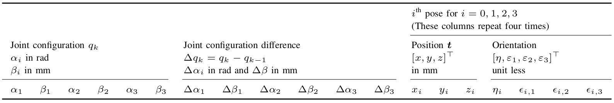

## A Dataset and Benchmark for Learning the Kinematics of Concentric Tube Continuum Robots

We present a dataset captured from a three-tube concentric tube continuum robot for use in learning-based kinematics research.
The dataset consists of 100 000 joint configurations and the corresponding four 6 dof sensors in SE(3) measured with an electromagnetic tracking system.
The dataset has been collected in eight sequences. 
Each sequence encompasses 12 500 dataset points. 
A dataset point consists all 6 dof of Cartesian space SE(3) described by the singularity free quaternion/vector-pairs for each sensor pose, all 6 dof of joints space Q, and the difference in joint space configuration to the previous configuration.

CRL-Dataset-CTCR-Pose is a lightweight dataset and has a size of 56.5 MB.
It is provided as a CVS file.
A dataset point consists:

- six absolute joint values
- six relative joint values
- pose of the base
- pose of the proximal sensor attached to the outermost tube
- pose of the sensor attached to the middle tube
- pose of the distal sensor attached to the most inner tube

The annotation of the dataset is provided in table below.



For more details on the dataset, our [paper](https://openreview.net/pdf?id=DW9uz_GZ0og) provide implementation details on the data acquisition and a brief overview of the used testbed including the robotic prototype.
Furthermore, insights on learning the kinematics of this type of robot and a discussion on open challenges are provided.

### Concentric Tube Continuum Robots

Concentric tube continuum robots (CTCR) are a class of continuum robots introduced in 2006.
A CTCR consists of multiple nested tubes that are concentric, pre-curved, and super-elastic.
To generate a motion by changing the centerline of the nested tubes, each tube can be rotated and translated as shown in this [video](https://youtu.be/1cXGMlcE5SE).
The kinematics of a CTCR is characterized by the highly non-linear behavior of the elastic interaction between the tubes.

CTCR are proposed and introduced simulatneously by

- Webster et al. [Toward Active Cannulas: Miniature Snake-Like Surgical Robots](https://doi.org/10.1109/IROS.2006.282073)
- Sears and Dupont [A Steerable Needle Technology Using Curved Concentric Tubes](https://doi.org/10.1109/IROS.2006.282072)

More details on CTCR, ckeck the following review paper

- Gilbert et al. [Concentric Tube Robots: The State of the Art and Future Directions](https://doi.org/10.1007/978-3-319-28872-7_15)
- Mahoney et al. [A review of concentric tube robots: modeling, control, design, planning, and sensing](https://doi.org/10.1142/9789813232266_0007)
- Mitros et al. [From Theoretical Work to Clinical Translation: Progress in Concentric Tube Robots](https://doi.org/10.1146/annurev-control-042920-014147)

For learning the kinematics of a CTCR, please take a look at the following paper.

- Bergeles et al. [Concentric tube robot kinematics using neural networks](https://scholar.google.com/scholar?as_sdt=0%2C31&q=Concentric+tube+robot+kinematics+using+neural+networks&btnG=)
- Grassmann et al. [Learning the Forward and Inverse Kinematics of a 6-DOF Concentric Tube Continuum Robot in SE(3)](https://doi.org/10.1109/IROS.2018.8594451)
- Grassmann and Burgner-Kahrs [On the Merits of Joint Space and Orientation Representations in Learning the Forward Kinematics in SE(3)](https://doi.org/10.15607/RSS.2019.XV.017)
- Kunzt et al. [Learning the complete shape of concentric tube robots](https://doi.org/10.1109/TMRB.2020.2974523)
- Grassmann et al. [A Dataset and Benchmark for Learning the Kinematics of Concentric Tube Continuum Robots](https://openreview.net/pdf?id=DW9uz_GZ0og)

### BibTeX

This repository is part of the following publication.
If you want to cite our CRL-Dataset-CTCR-Pose, you can use our [paper](https://doi.org/10.1109/IROS47612.2022.9981719):

```bibtex
    @inproceedings{GrassmannBurgner-Kahrs_et_al_IROS_2022,
        title       =   {A Dataset and Benchmark for Learning the Kinematics of Concentric Tube Continuum Robots},
        author      =   {Grassmann, Reinhard M. and Chen, Ryan Zeyuan and Liang, Nan and Burgner-Kahrs, Jessica},
        doi         =   {10.1109/IROS47612.2022.9981719}
        year        =   {2022},
        booktitle   =   {IEEE/RSJ International Conference on Intelligent Robots and Systems (IROS)},
    }
```
